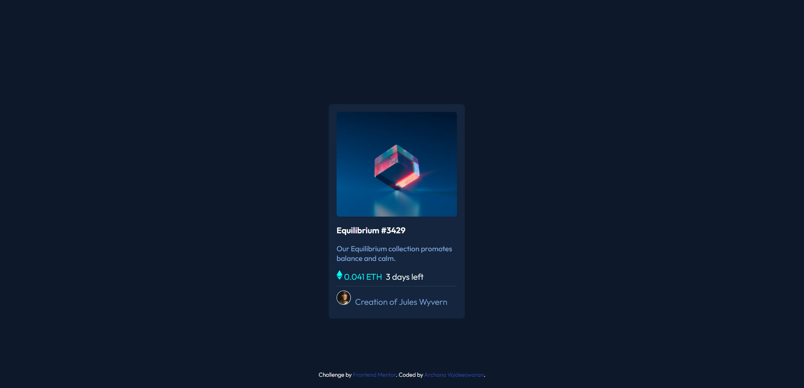

# Frontend Mentor - NFT preview card component solution

This is a solution to the [NFT preview card component challenge on Frontend Mentor](https://www.frontendmentor.io/challenges/nft-preview-card-component-SbdUL_w0U).

## Overview

I have tried this Frontend Mentor challenge for the first time using my knowledge of HTML and CSS that I had learnt in college. If you would suggest any imporovement to my work, feel free to reach out to my Frontend Mentor profile. I have linked it down below. Thanks in advance!!!

### The challenge

Users should be able to:

- View the optimal layout depending on their device's screen size
- See hover states for interactive elements

### Screenshot

### Links

- Solution URL: [Frontend Mentor NFT Preview Card Component Challenge](https://www.frontendmentor.io/solutions/nft-preview-card-component-CRhRsAr_X)
- Live Site URL: [NFT Card Preview](https://archanavaideeswaran.github.io/NFTCardPreview/)

## My process

The HTML was the easiest part for me so I started out and finished it first. Then for each of the elements I started writing CSS properties. I didn't use JavaScript because I am still learning and didn't want to get into too mmuch detail so that I will learn everything in a step by step manner. I struggled a lot with hover transitions and the image transisition part is still inprogress.

### Built with

- Semantic HTML5 markup
- CSS custom properties

### What I learned

- I thought HTML and CSS are very easy for me and I can handle things but for each CSS property I had to learn what arguments to provide and how to write them properly.
- Doing one thing at a time is pretty helpful.
- Doing this challenge gave me insights on how I will have to design a application in future.
- I have never used svg before and now I know something about svg's.

### Continued development

I will continue focusing on CSS properties because there are ton of properties out their and I wish to try as and when I encounter their need. I will also try to improve the style and use style guides available so it will help me in choosing the correct styling and design for my future projects.

## Author

- Frontend Mentor - [@ArchanaVaideeswaran](https://www.frontendmentor.io/profile/ArchanaVaideeswaran)

